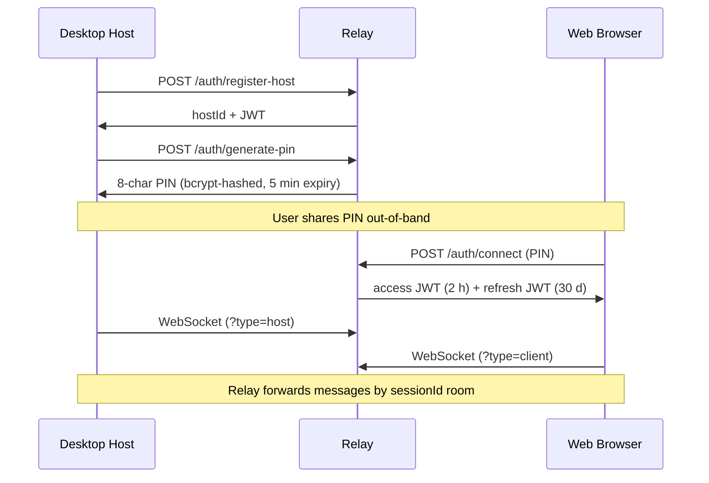

# RemoteBridge

Access your PC's files from anywhere — no port forwarding, no VPN, no dynamic DNS.

RemoteBridge uses a **relay server architecture**: an Electron desktop app (the *Host*) on your PC connects outbound to a public relay over WebSocket; a Next.js web client connects to the same relay and the relay forwards messages between them via session-keyed rooms. Your PC never listens on a public port.

```
Web Browser  ──────►  Relay Server  ◄──────  Desktop Host (your PC)
  (client)               (cloud)               (Electron app)
```

## Features

- **Zero firewall config** — the desktop app initiates outbound connections only; no inbound ports required
- **PIN-based pairing** — generate a short-lived 8-character PIN on the Host, enter it in the browser to connect
- **File browsing & download** — browse whitelisted directories, download files with HTTP Range resume support
- **In-browser file preview** — images, PDFs, text files previewed up to 10 MB via proxied blob URLs
- **Real-time messaging** — persistent message history with REST fallback when WebSocket is unavailable
- **Session management** — revoke individual client sessions instantly from the desktop app
- **Security audit log** — every file access attempt (allowed and blocked) is logged and viewable in-browser
- **Auto-update** — the desktop app checks GitHub Releases for updates on startup
- **Self-hostable** — one-command Docker Compose deploy; bring your own domain and TLS via Caddy

## Tech Stack

| Component | Technology |
|-----------|-----------|
| Desktop Host | Electron 28 · Fastify (local file server) · better-sqlite3 |
| Relay Server | Fastify · `@fastify/websocket` · better-sqlite3 · Drizzle ORM |
| Web Client | Next.js 14 App Router · Zustand · Tailwind CSS |
| Shared | TypeScript protocol types · path-security validation |
| Tooling | pnpm workspaces · Turborepo · Vitest · electron-vite |

## How It Works

### Connection



### File Downloads

Downloads are proxied through the relay via a WebSocket file tunnel (`CMD_FETCH_FILE`). The Host streams 256 KB binary frames with backpressure; the relay pipes them into the HTTP response. HTTP `Range` headers are preserved end-to-end so large downloads are resumable.

### Security

- Every file path is validated against the **user-configured whitelist** and an **OS-specific system directory blacklist** before any operation
- Download tokens are single-use UUIDs bound to the requesting `clientId`, expiring after 30 minutes
- JWT access tokens (2 h) and refresh tokens (30 d) use separate signing secrets; refresh tokens carry a `use: 'refresh'` claim and are rejected on WebSocket connect
- The Electron renderer runs with `sandbox: true` and a strict CSP; PDF previews use a sandboxed iframe without `allow-same-origin`

## Getting Started

### Prerequisites

- Node.js 20+
- pnpm 9+ (`npm i -g pnpm`)
- Git Bash or WSL (for `.sh` scripts on Windows)

### Quick bootstrap

```sh
git clone https://github.com/Aswellle/RemoteBridge.git
cd RemoteBridge
bash scripts/setup.sh          # pnpm install + build shared package
```

Copy the server environment file and fill in the required secrets:

```sh
cp apps/server/.env.example apps/server/.env
# Edit .env — set JWT_SECRET, JWT_REFRESH_SECRET, ALLOWED_ORIGINS
```

### Development

Start all services in watch mode:

```sh
pnpm dev
# Relay  → http://localhost:3002
# Web    → http://localhost:3000
# Desktop → Electron window
```

Run services individually:

```sh
pnpm --filter @remotebridge/server dev     # relay only
pnpm --filter @remotebridge/web dev        # web client only
pnpm --filter @remotebridge/desktop dev    # Electron host
```

> **Desktop native module note**  
> `better-sqlite3` must be compiled for the Electron ABI, not the system Node ABI. If the desktop app crashes with a `NODE_MODULE_VERSION` mismatch on first run, execute:
>
> ```powershell
> # Windows (PowerShell)
> .\scripts\dev-desktop.ps1
> ```
> ```sh
> # macOS / Linux
> cd apps/desktop && npx @electron/rebuild -f -w better-sqlite3 && cd ../..
> ```
>
> After rebuilding, copy the resulting binary to `.cache/better_sqlite3.electron.node` so it persists across reinstalls. The server may need `pnpm rebuild better-sqlite3` afterwards if it was affected.

### Tests

All four packages have Vitest suites. The server suite auto-spawns a relay on `:3099` so no manual setup is needed:

```sh
pnpm --filter @remotebridge/shared test
pnpm --filter @remotebridge/server test    # auto-spawns relay on :3099
pnpm --filter @remotebridge/desktop test
pnpm --filter @remotebridge/web test
```

## Environment Variables

### Relay Server (`apps/server/.env`)

| Variable | Default | Description |
|----------|---------|-------------|
| `JWT_SECRET` | — | **Required.** Access token signing key (≥ 32 chars) |
| `JWT_REFRESH_SECRET` | — | **Required.** Refresh token signing key (separate from above) |
| `ALLOWED_ORIGINS` | — | Comma-separated CORS origins (e.g. `https://yourdomain.com`) |
| `RELAY_PORT` | `3002` | Listening port |
| `RELAY_HOST` | `0.0.0.0` | Bind address |
| `RB_DATA_DIR` | `~/.remotebridge/data` | SQLite database directory |
| `NODE_ENV` | — | Set to `production` to enforce secret strength at startup |

Generate strong secrets:

```sh
openssl rand -base64 48   # run twice — one for each JWT secret
```

### Web Client

| Variable | Default | Description |
|----------|---------|-------------|
| `NEXT_PUBLIC_API_URL` | `http://localhost:3002/api/v1` | Relay REST endpoint |
| `NEXT_PUBLIC_WS_URL` | `ws://localhost:3002/ws` | Relay WebSocket endpoint |

> These are **build-time** variables. Changing them requires rebuilding the Next.js image, not just restarting the container.

## Deployment

### Docker Compose (recommended)

```sh
# Set your domain and secrets in docker-compose.yml / .env, then:
docker compose up -d
```

Services:
- **`server`** — relay, SQLite database persisted to a named volume
- **`web`** — Next.js standalone build
- **`caddy`** — TLS-terminating reverse proxy (auto Let's Encrypt when `DOMAIN` is set)

### Bare metal

```sh
bash scripts/deploy-server.sh   # tsc build → node dist/index.js via systemd
```

A sample systemd unit is at `deploy/systemd/remotebridge-server.service`.

Health check: `GET /health` returns relay status, DB write-probe result, and row counts.

### Desktop app

Download the latest installer from [Releases](https://github.com/Aswellle/RemoteBridge/releases) or build locally:

```sh
pnpm --filter @remotebridge/desktop package:win    # Windows NSIS installer
pnpm --filter @remotebridge/desktop package:mac    # macOS DMG
pnpm --filter @remotebridge/desktop package:linux  # Linux AppImage
```

## CI / CD

Every push and pull request runs the full CI pipeline (build → typecheck → lint → test across all packages) via `.github/workflows/ci.yml`.

Pushing a version tag triggers the release pipeline:

```sh
git tag v1.2.3
git push origin v1.2.3
```

GitHub Actions builds installers for Windows, macOS (x64), and Linux in parallel and publishes them to GitHub Releases. The desktop app's auto-updater checks this release feed on startup.

## Contributing

1. Fork and clone the repository
2. Run `bash scripts/setup.sh` to install dependencies
3. Make your changes — the shared package must be rebuilt after editing (`pnpm --filter @remotebridge/shared build`)
4. Ensure all tests pass: `pnpm --filter @remotebridge/server test && pnpm --filter @remotebridge/web test`
5. Open a pull request against `main`

## License

MIT
