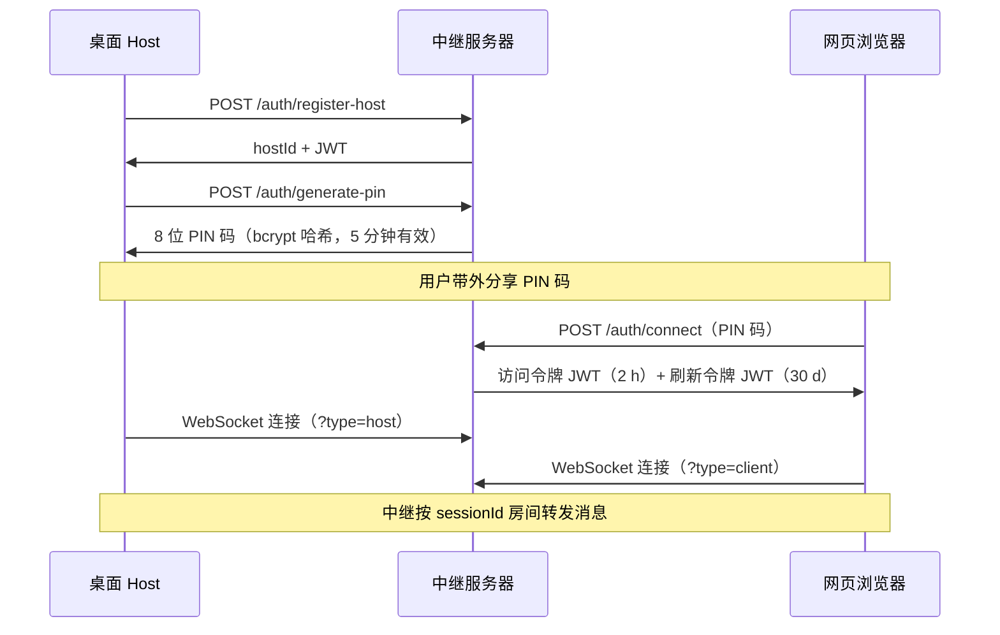

# RemoteBridge

**[English](./README.en.md)**

随时随地访问你的电脑文件 —— 无需端口转发，无需 VPN，无需动态 DNS。

RemoteBridge 采用**中继服务器架构**：运行在你电脑上的 Electron 桌面应用（*Host 端*）主动向公网中继服务器建立 WebSocket 出站连接；网页客户端连接到同一中继，中继按会话 ID 将消息在两端之间转发。你的电脑始终不对外监听任何端口。

```
网页浏览器  ──────►  中继服务器  ◄──────  桌面 Host（你的电脑）
  （客户端）          （云端）              （Electron 应用）
```

## 适用场景

### 远程办公
在家工作但需要访问公司电脑上的文件？在浏览器中打开 RemoteBridge，输入 Host 端生成的 PIN 码即可浏览和下载文件，无需 VPN 客户端、无需 IT 工单、无需 TeamViewer。

### 同事之间传递大文件
需要将大型构建产物、设计资源或日志包移交给同事？共享 PIN 码，让对方直接从你的机器上取走文件，完成后吊销会话即可。不需要上传到任何第三方云存储。

### 个人 NAS / 家庭服务器远程访问
在家用服务器或 NAS 上运行 Host 端，从任意浏览器访问媒体库、文档或备份文件，不论是酒店 Wi-Fi、手机热点还是公司内网，无需在路由器上开放端口。

### 开发工作流
将开发机上的某个项目目录设为白名单。测试工程师或设计师可以直接预览构建产物、查看日志、下载资源，无需 SSH 权限，也无需搭建共享磁盘。

### 小团队协作（无需 IT 基础设施）
无需 Active Directory、共享驱动器或 VPN 配置。每位成员在自己的电脑上运行 Host 端，按需生成 PIN 码共享给对方，任务结束后吊销会话。审计日志记录每一次访问。

### 教育与实验室场景
学生或研究人员可在课外时间远程获取实验室工作站上的文件，无需机构将 RDP 或 SSH 暴露在公网上。

---

## 功能特性

- **零防火墙配置** —— 桌面应用仅发起出站连接，无需开放任何入站端口
- **PIN 码配对** —— Host 端生成短效 8 位 PIN 码，浏览器输入即可建立连接
- **文件浏览与下载** —— 浏览白名单目录，支持 HTTP Range 断点续传下载
- **浏览器内文件预览** —— 图片、PDF、文本文件最大支持 10 MB 预览，通过代理 Blob URL 实现
- **实时消息** —— 持久化消息历史，WebSocket 不可用时自动回退到 REST 接口
- **会话管理** —— 在桌面应用中即时吊销任意客户端会话
- **安全审计日志** —— 所有文件访问尝试（允许与拒绝）均记录并可在浏览器中查看
- **自动更新** —— 桌面应用启动时检查 GitHub Releases 中的新版本
- **完全自托管** —— 一条命令完成 Docker Compose 部署，支持自有域名和 Caddy 自动 TLS

## 技术栈

| 组件 | 技术 |
|------|------|
| 桌面 Host | Electron 28 · Fastify（本地文件服务器）· better-sqlite3 |
| 中继服务器 | Fastify · `@fastify/websocket` · better-sqlite3 · Drizzle ORM |
| 网页客户端 | Next.js 14 App Router · Zustand · Tailwind CSS |
| 共享协议层 | TypeScript 协议类型定义 · 路径安全校验 |
| 工程化 | pnpm workspaces · Turborepo · Vitest · electron-vite |

## 工作原理

### 连接流程



### 文件下载

下载通过 WebSocket 文件隧道（`CMD_FETCH_FILE`）经中继代理传输。Host 端以 256 KB 二进制帧流式发送并带背压控制，中继直接写入 HTTP 响应体。HTTP `Range` 请求头端到端保留，大文件下载支持断点续传。

### 安全机制

- 每次文件操作前，路径均经过**用户配置的白名单**和**系统敏感目录黑名单**双重校验
- 下载令牌为一次性 UUID，绑定请求方的 `clientId`，30 分钟后过期
- 访问令牌（2 h）与刷新令牌（30 d）使用独立签名密钥；刷新令牌携带 `use: 'refresh'` 声明，WebSocket 连接时会被拒绝
- Electron 渲染进程以 `sandbox: true` 运行并配置严格 CSP；PDF 预览使用无 `allow-same-origin` 的沙盒 iframe

## 快速开始

### 前置条件

- Node.js 20+
- pnpm 9+（`npm i -g pnpm`）
- Git Bash 或 WSL（Windows 下运行 `.sh` 脚本需要）

### 一键初始化

```sh
git clone https://github.com/Aswellle/RemoteBridge.git
cd RemoteBridge
bash scripts/setup.sh          # pnpm install + 构建 shared 包
```

复制服务端环境变量文件并填写必要密钥：

```sh
cp apps/server/.env.example apps/server/.env
# 编辑 .env，设置 JWT_SECRET、JWT_REFRESH_SECRET、ALLOWED_ORIGINS
```

### 开发模式

一键启动所有服务（热更新）：

```sh
pnpm dev
# 中继服务器 → http://localhost:3002
# 网页客户端 → http://localhost:3000
# 桌面应用   → Electron 窗口
```

单独启动各服务：

```sh
pnpm --filter @remotebridge/server dev     # 仅中继服务器
pnpm --filter @remotebridge/web dev        # 仅网页客户端
pnpm --filter @remotebridge/desktop dev    # 仅桌面 Host
```

> **桌面端 Native 模块说明**
> `better-sqlite3` 必须针对 Electron ABI 编译，而非系统 Node.js ABI。如果桌面应用首次运行时崩溃并提示 `NODE_MODULE_VERSION` 不匹配，请执行：
>
> ```powershell
> # Windows（PowerShell）
> .\scripts\dev-desktop.ps1
> ```
> ```sh
> # macOS / Linux
> cd apps/desktop && npx @electron/rebuild -f -w better-sqlite3 && cd ../..
> ```
>
> 重新编译后，将生成的二进制文件复制到 `.cache/better_sqlite3.electron.node` 以在重装依赖后保留。此后服务端可能需要执行 `pnpm rebuild better-sqlite3` 以恢复正常。

### 运行测试

四个包均有 Vitest 测试套件。服务端套件会自动在 `:3099` 上启动一个中继，无需手动准备：

```sh
pnpm --filter @remotebridge/shared test
pnpm --filter @remotebridge/server test    # 自动启动中继于 :3099
pnpm --filter @remotebridge/desktop test
pnpm --filter @remotebridge/web test
```

## 环境变量

### 中继服务器（`apps/server/.env`）

| 变量 | 默认值 | 说明 |
|------|--------|------|
| `JWT_SECRET` | — | **必填。** 访问令牌签名密钥（≥ 32 字符） |
| `JWT_REFRESH_SECRET` | — | **必填。** 刷新令牌签名密钥（与上方独立） |
| `ALLOWED_ORIGINS` | — | CORS 允许来源，逗号分隔（如 `https://yourdomain.com`） |
| `RELAY_PORT` | `3002` | 监听端口 |
| `RELAY_HOST` | `0.0.0.0` | 绑定地址 |
| `RB_DATA_DIR` | `~/.remotebridge/data` | SQLite 数据库目录 |
| `NODE_ENV` | — | 设为 `production` 时启动时强制校验密钥强度 |

生成强密钥：

```sh
openssl rand -base64 48   # 执行两次，分别用于两个 JWT 密钥
```

### 网页客户端

| 变量 | 默认值 | 说明 |
|------|--------|------|
| `NEXT_PUBLIC_API_URL` | `http://localhost:3002/api/v1` | 中继 REST 接口地址 |
| `NEXT_PUBLIC_WS_URL` | `ws://localhost:3002/ws` | 中继 WebSocket 地址 |

> 这两个变量在**构建时**内嵌到客户端包中。修改后需重新构建 Next.js 镜像，仅重启容器无效。

## 部署

### Docker Compose（推荐）

```sh
# 在 docker-compose.yml / .env 中设置域名和密钥，然后：
docker compose up -d
```

包含三个服务：
- **`server`** —— 中继服务器，SQLite 数据库通过命名卷持久化
- **`web`** —— Next.js 独立构建产物
- **`caddy`** —— TLS 反向代理（设置 `DOMAIN` 后自动申请 Let's Encrypt 证书）

### 裸机部署

```sh
bash scripts/deploy-server.sh   # tsc 编译 → 通过 systemd 运行 node dist/index.js
```

systemd 单元文件示例位于 `deploy/systemd/remotebridge-server.service`。

健康检查：`GET /health` 返回中继状态、数据库写入探针结果及各表行数。

### 桌面客户端

从 [Releases](https://github.com/Aswellle/RemoteBridge/releases) 下载最新安装包，或本地构建：

```sh
pnpm --filter @remotebridge/desktop package:win    # Windows NSIS 安装包
pnpm --filter @remotebridge/desktop package:mac    # macOS DMG
pnpm --filter @remotebridge/desktop package:linux  # Linux AppImage
```

## CI / CD

每次推送和 Pull Request 都会触发完整 CI 流水线（构建 → 类型检查 → Lint → 测试），由 `.github/workflows/ci.yml` 定义。

推送版本 tag 触发发布流水线：

```sh
git tag v1.2.3
git push origin v1.2.3
```

GitHub Actions 并行构建 Windows、macOS（x64）和 Linux 安装包，发布到 GitHub Releases。桌面应用启动时会自动检查此 Release 源获取更新。

## 贡献指南

1. Fork 并克隆仓库
2. 执行 `bash scripts/setup.sh` 安装依赖
3. 修改代码 —— 编辑 shared 包后需重新构建（`pnpm --filter @remotebridge/shared build`）
4. 确保测试通过：`pnpm --filter @remotebridge/server test && pnpm --filter @remotebridge/web test`
5. 向 `main` 分支提交 Pull Request

## 开源协议

MIT
