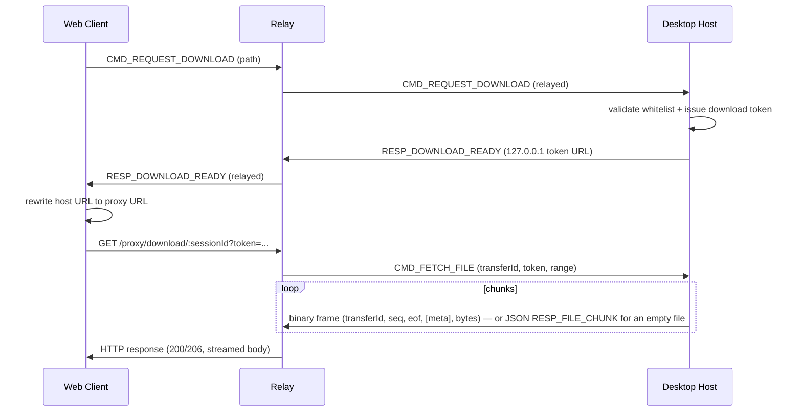

# ADR-004: WS file-tunnel framing (base64 JSON chunks)

> Status: **Accepted (as built)**

## Context

The Host's local file server (`apps/desktop/src/main/file-server/`) binds to `127.0.0.1`
only, so the Relay cannot reach it directly over HTTP across NAT. Yet the web client needs
to download/preview files via the Relay's `proxy/download/:sessionId` and
`proxy/preview/:sessionId` REST routes (so the browser can attach an `Authorization`
header, which ``/`<a href>` cannot do, and so Range/resume works through a single
authenticated endpoint).

The only channel available between Relay and Host is the Host's existing outbound
WebSocket connection — the same one used for `CMD_*`/`RESP_*`/`MSG_TEXT` protocol
messages, all of which are JSON-serialized `WSMessage` envelopes
(`packages/shared/src/ws-types.ts`).

## Decision

File content is tunneled over that WS connection using one of two wire formats, chosen
per-chunk:

- **Non-empty chunks (the common case, P1-12)**: each 256KB chunk is sent as a
  self-describing **binary** WS frame, encoded by `packages/shared/src/file-tunnel-codec.ts`'s
  `encodeFileChunkFrame` — a small fixed header (version byte, eof/hasMeta flag bits,
  `transferId`, `seq`, and — only on `seq === 0` — `totalSize`/`rangeStart`/`rangeEnd`/
  `contentType`/`fileName`) immediately followed by the raw chunk bytes. The Host
  (`apps/desktop/src/main/ws-client/file-tunnel.ts`) sends it via
  `RelayClient.sendRaw(buffer)` (`apps/desktop/src/main/ws-client/client.ts`), which calls
  `this.ws.send(buffer)` directly — `ws` auto-detects binary frames for `Buffer` payloads,
  no JSON envelope, no base64.
- **Empty files** (`totalSize === 0`): represented as a single JSON `RESP_FILE_CHUNK` with
  `data: ''`, `eof: true` — no binary frame needed for a zero-byte transfer.
- **Errors**: `RESP_FILE_ERROR` is always a JSON envelope (rare, no perf concern).

Round trip:

- The proxy route (`apps/server/src/routes/proxy.ts`) first obtains a single-use download
  token via the normal `CMD_REQUEST_DOWNLOAD` / `CMD_REQUEST_PREVIEW` →
  `RESP_DOWNLOAD_READY` / `RESP_PREVIEW_READY` round trip (see the sequence diagram below).
- It then registers a `transferId` in `apps/server/src/ws/file-tunnel.ts`
  (`beginFileTransfer`) **before** sending `CMD_FETCH_FILE` to the Host, so any binary
  chunk frame or JSON `RESP_FILE_CHUNK`/`RESP_FILE_ERROR` carrying that `transferId` is
  consumed server-side and never relayed to the Client.
- On the Relay, `apps/server/src/ws/handler.ts`'s WS `message` handler branches on `ws`'s
  `isBinary` flag: `isBinary === true` → `decodeFileChunkFrame` →
  `resolveFileTunnelBinaryFrame` (`ws/file-tunnel.ts`); `isBinary === false` → the existing
  `JSON.parse` → `resolveFileTunnelMessage` (`ws/file-tunnel.ts`, which still does
  `Buffer.from(payload.data, 'base64')` for the empty-file/legacy case). Both paths
  normalize into the same `{ data: Buffer, ... }` shape, so `routes/proxy.ts`'s
  `tunnelFromHost` writes `chunk.data` directly into the hijacked HTTP response
  (`reply.hijack()`) either way — **no branching in `proxy.ts`** — preserving `Range`/`206`
  semantics from the original client request.
- Backpressure is unchanged: the Host pauses sending once its WS send buffer exceeds a
  **4MB high-water mark**, polling every 50ms until it drains, bounding in-flight memory on
  both ends regardless of transfer size or framing.

Tunnel frames (binary chunk frames, `CMD_FETCH_FILE`, `RESP_FILE_CHUNK`, `RESP_FILE_ERROR`)
are **relay↔host only** — they are never forwarded to, or originated by, a web/desktop
Client.

**Backward compatibility, no version negotiation**: the relay's `isBinary` branch means a
Host that predates P1-12 (still sending JSON `RESP_FILE_CHUNK` for every chunk, including
non-empty ones) continues to work unchanged via the `isBinary === false` path — relevant
given P1-23 (no desktop auto-update/distribution pipeline yet).

### Sequence diagram

## Consequences

- **No base64 overhead on the hot path**: non-empty chunks (the overwhelming majority of
  bytes transferred) skip the `Buffer (256KB) → base64 string (~341KB) → JSON.stringify`
  encode and `JSON.parse → Buffer.from(..., 'base64')` decode entirely — one
  `Buffer.concat([header, chunk])` on send, one header-parse + `subarray` on receive. This
  eliminates the ~2.3x allocation overhead and ~1s cumulative blocking CPU (per 500MB
  transfer) that motivated P1-12 (`docs/file-tunnel-binary-framing-design.md`), on both the
  Host's main process and the Relay.
- **Simplicity retained for the rare paths**: the empty-file sentinel and `RESP_FILE_ERROR`
  keep reusing the existing `WSMessage` envelope, JSON serialization, and
  routing-exception machinery (`resolveFileTunnelMessage`, `ws/pending-requests.ts`-adjacent
  registration pattern) — no need to special-case these low-volume, perf-insensitive cases.
- **Backward compatible, no forced cutover**: the relay's `isBinary` branch means
  not-yet-updated Hosts (still sending all-JSON `RESP_FILE_CHUNK`) keep working
  indefinitely via the legacy path — relevant given P1-23 (no desktop auto-update/
  distribution pipeline yet). If the legacy path is ever removed, that's a deliberate
  major-version change documented in `CHANGELOG.md`, not a silent drop.
- **Memory safety unchanged**: the 4MB backpressure design bounds in-flight memory on both
  ends regardless of framing or transfer size — this was already true for the base64-JSON
  format and remains true for binary frames.

## Status

**Accepted (as built)**. Both formats are live: binary frames
(`packages/shared/src/file-tunnel-codec.ts`'s `encodeFileChunkFrame`/`decodeFileChunkFrame`)
for non-empty chunks, JSON `RESP_FILE_CHUNK`/`RESP_FILE_ERROR` for empty files and errors.
See `docs/file-tunnel-binary-framing-design.md` (P1-12, **Implemented**) for the binary
frame's detailed wire layout and design rationale.
