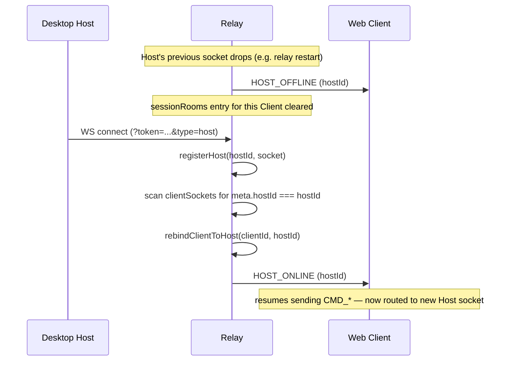

# ADR-005: In-memory, single-instance relay room state

> Status: **Accepted**

## Context

The Relay Server (`apps/server`) must track which Host and Client WebSocket connections
belong to the same session ("room"), so it can forward `WSMessage`s by `sessionId` —
Client↔Host message relay, file-tunnel routing, `HOST_ONLINE`/`HOST_OFFLINE` broadcasts,
etc. This room state (`hostSockets`, `clientSockets`, `sessionRooms`) is currently three
in-memory `Map`s owned by `apps/server/src/ws/connection-registry.ts` (see "Implementation"
below) — the relay itself stores no files and persists no room state to disk.

The alternative would be an externalized room registry (e.g. Redis pub/sub) enabling
horizontal scaling to multiple relay instances behind a load balancer. That adds an
operational dependency and cross-instance message-routing complexity that the project does
not currently need.

## Decision

Accept **in-memory room state, single relay instance**, on the basis that a relay restart
is self-healing:

- **Both ends reconnect automatically and unlimitedly**: the desktop Host and web Client
  each use exponential backoff (1s–30s, unlimited retries) per CLAUDE.md's Heartbeat flow.
- **Host-reconnect rebuilds the room mapping**: when a Host (re)connects, the relay scans
  all currently-connected Clients for ones whose stored `hostId` metadata matches the
  reconnecting Host, calls `rebindClientToHost` for each, and broadcasts `HOST_ONLINE` to
  them — restoring `sessionRooms` entries that were cleared when the Host's previous
  connection dropped.
- **Sessions, messages, and security logs are persisted in SQLite** (`RB_DATA_DIR`), not in
  the in-memory Maps — a relay restart loses only the live socket↔session mappings, never
  durable data. Clients holding a valid (non-revoked) access token can resume immediately
  after reconnecting.
- **In-flight transfers/messages have a bounded risk window**: anything mid-flight at the
  moment of restart (a file-tunnel chunk sequence, an unacknowledged `MSG_TEXT`) is lost,
  but is recoverable by client-side mechanisms that already exist for other reasons —
  downloads resume via HTTP `Range`, and chat messages dedupe via `messageId` with a REST
  fallback send path. See `docs/runbook.md` §1.1 for the full self-healing argument and this
  risk-window caveat.

### Sequence diagram: Host reconnect / room rebuild

## Implementation

`apps/server/src/ws/connection-registry.ts` is the sole owner of room state — the
`hostSockets`/`clientSockets`/`sessionRooms` Maps and `ConnectionMeta` are private to this
module. It exposes registration (`registerHost`/`unregisterHost`/`registerClient`/
`unregisterClient`, each returning a boolean used as a reconnect-race guard: only remove if
the registered socket still matches the caller's), lookups (`getHostSocket`/
`getClientSocket`/`isHostOnline`/`isClientOnline`/`getClientHost`/`getHostClients`/
`getRoomInfo`), iteration (`forEachHost`/`forEachClient`/`forEachClientOfHost`), and room
rebinding for host-reconnect (`rebindClientToHost`, `clearHostClients`, `clearAll`).

`apps/server/src/ws/relay.ts` is the unified message-sending layer built on top of
`connection-registry.ts`: `sendWSMessage`, `relayToHost`/`relayToClient`/`relayMessage`,
`notifyHost`/`notifyAndDisconnectClient`, and `sendToClient`/`sendToHost`/
`broadcastToHostClients`. `ws/handler.ts`'s message loop, proxy routes, and REST routes
(`routes/messages.ts`, `routes/auth.ts`, `routes/hosts.ts`) all call into these two modules
— there is one access pattern and one send-layer module, no `routes/*` reach-through into
`ws/handler.ts` internals.

This consolidation (`docs/relay-room-state-design.md`, P1-7, status: implemented) is what
makes `connection-registry.ts` the single seam where a future externalized (e.g.
Redis-backed) room registry could be substituted, if/when multi-instance horizontal scaling
becomes necessary — every consumer already goes through this one module's accessor API
rather than touching raw `Map`s directly.

## Consequences

- **Simple, no extra infrastructure**: no Redis/pub-sub dependency, no cross-instance
  message routing, no distributed-state consistency concerns.
- **Single point of failure for live routing**: only one relay process can hold room state
  at a time — this rules out horizontal scaling or zero-downtime rolling restarts of the
  relay without a brief reconnect window for all connected Hosts/Clients.
- **Restart is the recovery mechanism**: both Docker Compose (`restart: unless-stopped`)
  and the systemd unit (`Restart=on-failure`) are load-bearing for this design — see
  `docs/runbook.md` §1.1 for crash-recovery procedures and the in-flight-transfer
  risk-window caveat.
- **Future externalization has one seam**: if multi-instance becomes necessary,
  `connection-registry.ts`'s accessor API (not its internal `Map`s) is the boundary to
  replace — `relay.ts` and all `routes/*` consumers would not need to change.

## Status

**Accepted**. In-memory single-instance room state, consolidated behind
`connection-registry.ts`/`relay.ts` per `docs/relay-room-state-design.md` (P1-7,
implemented). No plan to change this absent a concrete multi-instance scaling requirement.
